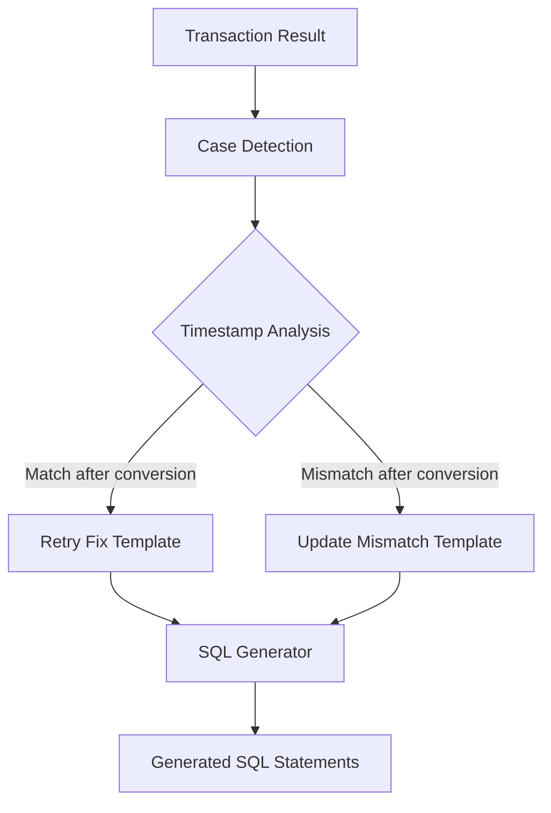

# Design Document

## Overview

This feature implements two specialized SQL template functions for handling cash-in workflows stuck at state 100 due to timestamp-related issues. The system will extend the existing RPP template architecture to support both simple retry cases and update mismatch cases, with proper timezone conversion between UTC and GMT+8.

## Architecture

The implementation follows the existing template-based architecture used in the buddy system:



The solution integrates with the existing `sql_templates_rpp_basic.go` file and leverages the current SQL generation infrastructure including:
- Template registration system
- Parameter handling with `ParamInfo` structs
- SQL validation and safety checks
- Deploy/rollback statement generation

## Components and Interfaces

### 1. New Case Types

Two new case constants will be added to `domain/types.go`:

```go
CaseCashInStuck100Retry         Case = "cash_in_stuck_100_retry"
CaseCashInStuck100UpdateMismatch Case = "cash_in_stuck_100_update_mismatch"
```

### 2. Template Functions

#### `cashInStuck100Retry`
- **Purpose**: Handle simple retry cases where timestamps match after timezone conversion
- **Input**: `domain.TransactionResult` with RPP workflow data
- **Output**: `*domain.DMLTicket` with retry SQL template
- **Logic**: Sets `attempt=1` without modifying timestamp data

#### `cashInStuck100UpdateMismatch`
- **Purpose**: Handle update mismatch cases requiring timestamp synchronization
- **Input**: `domain.TransactionResult` with RPP workflow data and converted timestamp
- **Output**: `*domain.DMLTicket` with update mismatch SQL template
- **Logic**: Sets `attempt=1` AND updates workflow data timestamp using JSON_SET

### 3. Timezone Conversion Utilities

#### `convertUTCToGMT8`
- **Purpose**: Convert UTC timestamps to GMT+8 format
- **Input**: UTC timestamp string
- **Output**: GMT+8 timestamp string (adds 8 hours)
- **Format**: Handles standard MySQL datetime format

#### `compareTimestampsWithTimezone`
- **Purpose**: Compare credit_transfer.updated_at (UTC) with workflow data UpdatedAt (GMT+8)
- **Input**: UTC timestamp, GMT+8 timestamp
- **Output**: Boolean indicating if timestamps match after conversion

### 4. Enhanced Case Detection

The existing case detection logic will be extended to:
1. Identify workflows stuck at state 100 with attempts > 0
2. Extract timestamp data from both credit_transfer table and workflow data
3. Perform timezone conversion and comparison
4. Route to appropriate fix template based on timestamp analysis

## Data Models

### Extended TransactionResult

The existing `TransactionResult` struct will be enhanced to include timestamp comparison data:

```go
type TimestampAnalysis struct {
    CreditTransferUpdatedAt string // UTC timestamp from credit_transfer table
    WorkflowDataUpdatedAt   string // GMT+8 timestamp from workflow data
    TimestampsMatch         bool   // Result of timezone-aware comparison
    ConvertedTimestamp      string // UTC converted to GMT+8 for mismatch fixes
}
```

### Template Parameters

Both templates will use these parameters:

```go
// For retry fix
[]ParamInfo{
    {Name: "run_id", Value: runID, Type: "string"},
}

// For update mismatch fix
[]ParamInfo{
    {Name: "run_id", Value: runID, Type: "string"},
    {Name: "converted_timestamp", Value: convertedTimestamp, Type: "string"},
}
```

## Correctness Properties

*A property is a characteristic or behavior that should hold true across all valid executions of a system-essentially, a formal statement about what the system should do. Properties serve as the bridge between human-readable specifications and machine-verifiable correctness guarantees.*

Based on the prework analysis, the following properties will be implemented to ensure correctness:

### Property 1: Retry Case Classification
*For any* workflow data with matching timestamps after timezone conversion, the system should classify it as a retry case
**Validates: Requirements 1.1, 1.2**

### Property 2: Mismatch Case Classification
*For any* workflow data with mismatched timestamps after timezone conversion, the system should classify it as an update mismatch case
**Validates: Requirements 2.1, 2.2**

### Property 3: Retry SQL Generation
*For any* retry case, the generated SQL should contain "attempt = 1" and should not contain JSON_SET operations on timestamp fields
**Validates: Requirements 1.3, 1.5**

### Property 4: Mismatch SQL Generation
*For any* mismatch case, the generated SQL should contain both "attempt = 1" and JSON_SET operation for $.CreditTransfer.UpdatedAt
**Validates: Requirements 2.3, 2.5, 2.6**

### Property 5: Timezone Conversion Accuracy
*For any* valid UTC timestamp, converting to GMT+8 should add exactly 8 hours to the timestamp
**Validates: Requirements 2.4, 3.1**

### Property 6: SQL Safety and Targeting
*For any* generated SQL, it should target workflow_execution table and include proper WHERE clauses with run_id, workflow_id='wf_ct_cashin', and state=100
**Validates: Requirements 1.4, 4.1, 4.2**

### Property 7: Timestamp Validation
*For any* invalid timestamp format, the conversion function should return an appropriate error message
**Validates: Requirements 3.3, 3.4**

### Property 8: SQL Comment Inclusion
*For any* generated SQL, it should include descriptive comments indicating the fix type being applied
**Validates: Requirements 4.5**

## Error Handling

The system will implement comprehensive error handling for:

1. **Invalid Timestamp Formats**: Validate timestamp strings before conversion
2. **Missing Workflow Data**: Handle cases where required workflow information is unavailable
3. **SQL Generation Failures**: Provide meaningful error messages for template generation issues
4. **Timezone Conversion Errors**: Handle edge cases in timestamp conversion

Error responses will include:
- Clear error messages indicating the specific issue
- Suggested remediation steps where applicable
- Logging for debugging and monitoring purposes

## Testing Strategy

The implementation will use a dual testing approach:

### Unit Tests
- Test specific timestamp conversion functions with known inputs/outputs
- Test SQL template generation with mock data
- Test error handling with invalid inputs
- Test case classification logic with various timestamp scenarios

### Property-Based Tests
- **Property Testing Framework**: Go's `testing/quick` package or `github.com/leanovate/gopter`
- **Test Configuration**: Minimum 100 iterations per property test
- **Coverage**: All correctness properties listed above will be implemented as property-based tests

Each property test will be tagged with:
**Feature: cash-in-stuck-100-fixes, Property {number}: {property_text}**

The testing strategy ensures both specific examples work correctly (unit tests) and universal properties hold across all inputs (property tests), providing comprehensive validation of the timestamp handling and SQL generation logic.
