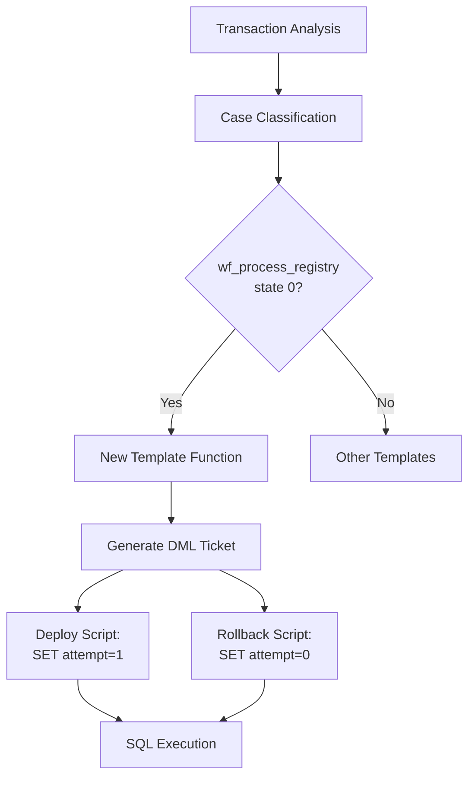

# Design Document: RPP Process Registry Init Fix

## Overview

This design implements automatic detection and remediation for RPP adapter workflows of type `wf_process_registry` that are stuck in state 0 (`stInit`). The solution follows the existing SQL template pattern used throughout the codebase, adding a new case type and template function to handle this specific scenario.

The fix addresses workflows that fail to progress from the initialization state by resetting the attempt counter to 1, allowing the workflow engine to retry the initialization process.

## Architecture

The solution integrates with the existing SQL template system architecture:



The implementation follows the established pattern:
1. **Case Detection**: Identify qualifying workflows during transaction analysis
2. **Template Registration**: Register new template function in RPP templates map
3. **SQL Generation**: Generate deploy and rollback scripts using existing infrastructure
4. **Execution**: Use existing SQL execution pipeline

## Components and Interfaces

### New Case Type
```go
const (
    CaseRppProcessRegistryStuckInit Case = "rpp_process_registry_stuck_init"
)
```

### Template Function Signature
```go
func rppProcessRegistryStuckInit(result domain.TransactionResult) *domain.DMLTicket
```

### Integration Points
- **Registration**: `registerRPPBasicTemplates()` function in `sql_templates_rpp_basic.go`
- **Case Order**: Add to `GetCaseSummaryOrder()` in `types.go`
- **Helper Functions**: Reuse existing `getRPPWorkflowRunIDByCriteria()` function

## Data Models

### Input Data Structure
The function expects `TransactionResult` with populated `RPPAdapter` field:
```go
type RPPAdapterInfo struct {
    Workflow []WorkflowInfo // Contains workflow executions to analyze
    // ... other fields
}

type WorkflowInfo struct {
    WorkflowID string // Must be "wf_process_registry"
    State      string // Must be "0"
    RunID      string // Used in SQL WHERE clause
    Attempt    int    // Current attempt count
}
```

### Output Data Structure
Returns `DMLTicket` with deploy and rollback templates:
```go
type DMLTicket struct {
    Deploy   []TemplateInfo // SQL to set attempt=1
    Rollback []TemplateInfo // SQL to set attempt=0
    CaseType Case           // CaseRppProcessRegistryStuckInit
}
```

## Correctness Properties

*A property is a characteristic or behavior that should hold true across all valid executions of a system-essentially, a formal statement about what the system should do. Properties serve as the bridge between human-readable specifications and machine-verifiable correctness guarantees.*

Now I'll analyze the acceptance criteria to determine which ones are testable as properties:

### Converting EARS to Properties

Based on the prework analysis, I'll convert the testable acceptance criteria into universally quantified properties:

**Property 1: Workflow Qualification**
*For any* transaction result containing RPP adapter workflows, only workflows with workflow_id='wf_process_registry' AND state='0' should be identified as requiring the initialization fix
**Validates: Requirements 1.1, 1.2, 5.4, 5.5**

**Property 2: Deploy Script Correctness**
*For any* qualifying wf_process_registry workflow, the generated deploy script should update workflow_execution table, set attempt=1, target the correct workflow_id and state, include the specific run_id in WHERE clause, and target RPP database
**Validates: Requirements 2.1, 2.2, 2.3, 2.4, 2.5, 4.6**

**Property 3: Rollback Script Consistency**
*For any* generated deploy script, the corresponding rollback script should target the same run_id and workflow_id, set attempt=0, and maintain consistency with the deploy script's targeting criteria
**Validates: Requirements 3.1, 3.2, 3.3**

**Property 4: SQL Documentation**
*For any* generated deploy or rollback script, the SQL should include descriptive comments explaining the purpose of the operation
**Validates: Requirements 2.6, 3.4**

**Property 5: Individual Workflow Processing**
*For any* transaction result with multiple qualifying wf_process_registry workflows in state 0, each workflow should be processed individually with its own run_id extracted and used
**Validates: Requirements 1.3, 1.4**

**Property 6: Ticket Structure Validation**
*For any* qualifying input, the returned DMLTicket should have properly formatted TemplateInfo structures with correct TargetDB, SQLTemplate, and Params fields
**Validates: Requirements 4.4, 4.6**

**Property 7: Input Validation**
*For any* transaction result with no qualifying workflows, empty/invalid run_ids, or missing RPPAdapter data, the system should return nil
**Validates: Requirements 5.1, 5.2, 5.3**

## Error Handling

The system handles various error conditions gracefully:

### Input Validation Errors
- **Nil RPPAdapter**: Returns nil immediately without processing
- **Empty Workflow List**: Returns nil when no workflows exist
- **Invalid run_id**: Returns nil when run_id is empty or contains only whitespace
- **Non-matching Criteria**: Returns nil when no workflows match the exact criteria

### SQL Generation Errors
- **Template Formatting**: Uses parameterized queries to prevent SQL injection
- **Parameter Validation**: Validates all parameters before SQL generation
- **Database Targeting**: Ensures all operations target the correct RPP database

### Safety Measures
- **Specific WHERE Clauses**: All SQL includes specific run_id, workflow_id, and state conditions
- **Rollback Capability**: Every deploy operation has a corresponding rollback
- **Comment Documentation**: All SQL includes explanatory comments for operational clarity

## Testing Strategy

The testing approach follows a dual strategy combining unit tests and property-based tests:

### Unit Testing
Unit tests will focus on:
- **Specific Examples**: Test with known good workflow data
- **Edge Cases**: Test with nil inputs, empty strings, invalid data
- **Integration Points**: Test registration and helper function usage
- **SQL Content**: Verify specific SQL content matches expected patterns

### Property-Based Testing
Property-based tests will validate universal properties across randomized inputs:
- **Workflow Filtering**: Generate random workflow combinations and verify correct filtering
- **SQL Consistency**: Generate random valid inputs and verify deploy/rollback consistency
- **Parameter Handling**: Generate random run_ids and verify proper parameterization
- **Input Validation**: Generate random invalid inputs and verify nil returns

**Property Test Configuration:**
- Minimum 100 iterations per property test
- Use Go's `testing/quick` package or `github.com/leanovate/gopter` for property-based testing
- Each property test tagged with: **Feature: rpp-process-registry-init-fix, Property {number}: {property_text}**

### Test Coverage Requirements
- All template functions must have corresponding unit tests
- All correctness properties must have property-based test implementations
- Integration tests should verify end-to-end SQL generation and execution
- Error handling paths must be covered by both unit and property tests

The combination of unit and property tests ensures both specific correctness and general robustness across all possible inputs.
