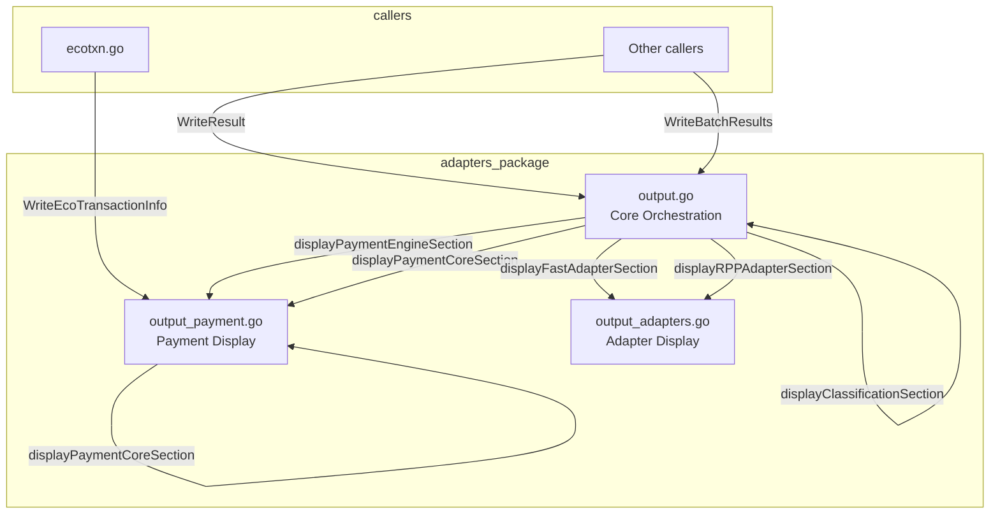

# Refactoring Plan: Split output.go into Domain-Specific Files

## Overview
Refactor `internal/txn/adapters/output.go` (currently ~600 lines) to reduce file size and improve maintainability by splitting display logic into domain-specific files within the same package.

## Current State Analysis

### File: `internal/txn/adapters/output.go` (600 lines)

**Functions to be moved:**

1. **Payment-related functions** (~298 lines):
   - `displayPaymentEngineSection` (lines 38-106) - Displays PaymentEngine section
   - `displayPaymentCoreSection` (lines 108-244) - Displays PaymentCore section
   - `WriteEcoTransactionResult` (lines 508-513) - Writes partnerpay-engine transaction result
   - `WriteEcoTransactionInfo` (lines 515-600) - Writes partnerpay-engine transaction info

2. **Adapter-related functions** (~137 lines):
   - `displayFastAdapterSection` (lines 246-301) - Displays FastAdapter section
   - `displayRPPAdapterSection` (lines 303-383) - Displays RPPAdapter section

**Functions to retain in output.go** (~165 lines):
   - `WriteBatchResults` (lines 11-23) - Writes batch results to file
   - `PrintTransactionStatus` (lines 25-31) - Deprecated function
   - `WriteResult` (lines 33-36) - Public API for writing single result
   - `displayClassificationSection` (lines 385-403) - Displays Classification section
   - `writeResult` (lines 405-506) - Internal helper that orchestrates display

### External Dependencies
- `WriteEcoTransactionInfo` is called from `internal/apps/mybuddy/commands/ecotxn.go`
- All functions are in the same package (`adapters`), so visibility will be preserved

## Proposed File Structure

```
internal/txn/adapters/
├── output.go              (~165 lines) - Core orchestration functions
├── output_payment.go      (~298 lines) - Payment display functions
└── output_adapters.go      (~137 lines) - Adapter display functions
```

## Detailed Refactoring Steps

### Step 1: Create `output_payment.go`
**Location:** `internal/txn/adapters/output_payment.go`

**Functions to include:**
1. `displayPaymentEngineSection(w io.Writer, pe domain.PaymentEngineInfo) error`
2. `displayPaymentCoreSection(w io.Writer, pc domain.PaymentCoreInfo) error`
3. `WriteEcoTransactionResult(w io.Writer, result domain.TransactionResult, index int)`
4. `WriteEcoTransactionInfo(w io.Writer, result domain.TransactionResult, transactionID string, index int)`

**Imports required:**
- `buddy/internal/txn/domain`
- `fmt`
- `io`

**Estimated line count:** ~298 lines (well under 500-line limit)

### Step 2: Create `output_adapters.go`
**Location:** `internal/txn/adapters/output_adapters.go`

**Functions to include:**
1. `displayFastAdapterSection(w io.Writer, fa domain.FastAdapterInfo) error`
2. `displayRPPAdapterSection(w io.Writer, ra domain.RPPAdapterInfo, isE2EID bool, transactionID string) error`

**Imports required:**
- `buddy/internal/txn/domain`
- `fmt`
- `io`

**Estimated line count:** ~137 lines (well under 500-line limit)

### Step 3: Update `output.go`
**Location:** `internal/txn/adapters/output.go`

**Actions:**
1. Remove moved functions (lines 38-383, 508-600)
2. Update `writeResult` function to call functions from new files (no code changes needed - same package)
3. Retain core functions:
   - `WriteBatchResults`
   - `PrintTransactionStatus`
   - `WriteResult`
   - `displayClassificationSection`
   - `writeResult`

**Estimated line count:** ~165 lines (well under 500-line limit)

### Step 4: Verification
1. Run `make build` - Build both binaries (mybuddy and sgbuddy)
2. Run `make lint` - Run gofmt, go vet, and golangci-lint
3. Verify no compilation errors
4. Verify no linting issues

## Architecture Diagram



## Dependencies Between Files

- `output.go` depends on `output_payment.go` and `output_adapters.go`
- `output_payment.go` has no dependencies on other output files
- `output_adapters.go` has no dependencies on other output files
- All files share the same package (`adapters`) and domain types

## Risk Assessment

| Risk | Impact | Mitigation |
|------|--------|------------|
| Breaking external API calls | High | `WriteEcoTransactionInfo` remains exported and accessible |
| Circular dependencies | Low | Clear dependency hierarchy: output.go → output_payment.go/output_adapters.go |
| Build failures | Medium | Run `make build` and `make lint` after refactoring |
| File size violations | Low | All new files estimated well under 500-line limit |

## Success Criteria

1. All three files are under 500 lines
2. `make build` succeeds without errors
3. `make lint` passes without warnings
4. External caller `ecotxn.go` continues to work correctly
5. No functionality changes - only code organization

## Notes

- Since all functions are in the same package, moving them to different files does not change their visibility
- Internal functions (lowercase) like `displayPaymentEngineSection` remain internal
- Exported functions (uppercase) like `WriteEcoTransactionInfo` remain exported
- No changes to function signatures or behavior
- This is a pure refactoring - no functional changes
