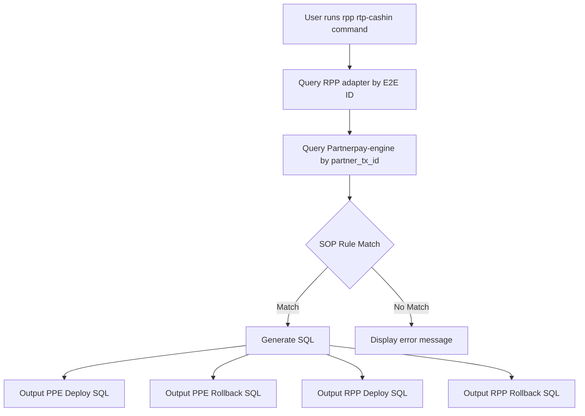

# RPP RTP Cashin Stuck at 200 Implementation Plan

## Problem Analysis

### Issue Description
When an RPP-adapter RTP cash in transaction is stuck at state 200 (stTransferProcessing) with attempt 0, the workflow cannot proceed because the intent in Partnerpay-engine has status 'CONFIRMED'. The transaction needs to be replayed by:

1. Updating the intent status from 'CONFIRMED' to 'UPDATED' in Partnerpay-engine
2. Updating the workflow state from 200 to 110 in RPP adapter
3. Incrementing the attempt count from 0 to 1

### Scenario Details
- **credit_transfer**: `partner_tx_id='0f20cdcbc8dd44a7915e6803c7542778'`, `end_to_end_id='20251229BIMBMYKL070ORB53488076'`
- **workflow_execution**: `state=200`, `attempt=0`, `workflow_id='wf_ct_rtp_cashin'`
- **intent** (Partnerpay): `type='RTP_TOP_UP'`, `status='CONFIRMED'`

### Workflow State Mapping
The `wf_ct_rtp_cashin` workflow has the following state mappings:
- `100`: stTransferPersisted
- `110`: stRequestToPayUpdated (target state for replay)
- `111`: stRequestToPayUpdateFailed
- `121`: stOriginalTransferValidated
- `122`: stFieldsValidationFailed
- `200`: stTransferProcessing (current stuck state)
- `201`: stTransferStreamPersisted
- `210`: stTransferUpdated
- `220`: stTransferRespPrepared
- `700`: stCashInFailed
- `701`: stCashInToRefund
- `900`: stCashInCompleted
- `901`: stCashInCompletedWithRefund

## Solution Design

### Approach
Implement a new SOP case `CaseRppRtpCashinStuck200_0` that generates SQL for both Partnerpay-engine (PPE) and RPP adapter databases.

### Data Flow



## Implementation Plan

### Step 1: Add Workflow Type Mapping
**File: [`internal/txn/domain/types.go`](internal/txn/domain/types.go)**

Add new workflow type `wf_ct_rtp_cashin` to `WorkflowStateMaps`:

```go
"wf_ct_rtp_cashin": {
    100: "stTransferPersisted",
    110: "stRequestToPayUpdated",
    111: "stRequestToPayUpdateFailed",
    121: "stOriginalTransferValidated",
    122: "stFieldsValidationFailed",
    200: "stTransferProcessing",
    201: "stTransferStreamPersisted",
    210: "stTransferUpdated",
    220: "stTransferRespPrepared",
    700: "stCashInFailed",
    701: "stCashInToRefund",
    900: "stCashInCompleted",
    901: "stCashInCompletedWithRefund",
},
```

### Step 2: Add Case Type Constant
**File: [`internal/txn/domain/types.go`](internal/txn/domain/types.go)**

Add new case type constant:

```go
CaseRppRtpCashinStuck200_0 Case = "rpp_rtp_cashin_stuck_200_0"
```

### Step 3: Add SOP Rule
**File: [`internal/txn/adapters/sop_rules.go`](internal/txn/adapters/sop_rules.go)**

Add new rule to identify the RTP cashin stuck scenario:

```go
{
    CaseType:    domain.CaseRppRtpCashinStuck200_0,
    Description: "RPP RTP Cashin stuck at state 200 with attempt 0",
    Country:     "my",
    Conditions: []RuleCondition{
        {
            FieldPath: "RPPAdapter.Workflow.WorkflowID",
            Operator:  "eq",
            Value:     "wf_ct_rtp_cashin",
        },
        {
            FieldPath: "RPPAdapter.Workflow.State",
            Operator:  "eq",
            Value:     "200",
        },
        {
            FieldPath: "RPPAdapter.Workflow.Attempt",
            Operator:  "eq",
            Value:     0,
        },
    },
},
```

### Step 4: Add SQL Templates
**File: [`internal/txn/adapters/sql_templates.go`](internal/txn/adapters/sql_templates.go)**

Add SQL template for the new case:

```go
domain.CaseRppRtpCashinStuck200_0: func(result domain.TransactionResult) *domain.DMLTicket {
    if result.RPPAdapter == nil {
        return nil
    }

    // Find workflow matching case criteria
    runID := getRPPWorkflowRunIDByCriteria(
        result.RPPAdapter.Workflow,
        "wf_ct_rtp_cashin",
        "200",
        0,
    )

    if runID == "" {
        return nil
    }

    // Get partner_tx_id for PPE SQL
    partnerTxID := result.RPPAdapter.PartnerTxID
    if partnerTxID == "" {
        return nil
    }

    return &domain.DMLTicket{
        Deploy: []domain.TemplateInfo{
            {
                TargetDB: "PPE",
                SQLTemplate: `-- rpp_rtp_cashin_stuck_200_0
UPDATE intent SET status = 'UPDATED'
WHERE intent_id = %s
AND status = 'CONFIRMED';`,
                Params: []domain.ParamInfo{
                    {Name: "intent_id", Value: partnerTxID, Type: "string"},
                },
            },
            {
                TargetDB: "RPP",
                SQLTemplate: `-- rpp_rtp_cashin_stuck_200_0
UPDATE workflow_execution
SET state = 110,
    attempt = 1,
    data = JSON_SET(data, '$.State', 110)
WHERE run_id = %s
AND state = 200
AND workflow_id = 'wf_ct_rtp_cashin';`,
                Params: []domain.ParamInfo{
                    {Name: "run_id", Value: runID, Type: "string"},
                },
            },
        },
        Rollback: []domain.TemplateInfo{
            {
                TargetDB: "PPE",
                SQLTemplate: `-- rpp_rtp_cashin_stuck_200_0 Rollback
UPDATE intent SET status = 'CONFIRMED'
WHERE intent_id = %s;`,
                Params: []domain.ParamInfo{
                    {Name: "intent_id", Value: partnerTxID, Type: "string"},
                },
            },
            {
                TargetDB: "RPP",
                SQLTemplate: `-- rpp_rtp_cashin_stuck_200_0 Rollback
UPDATE workflow_execution
SET state = 200,
    attempt = 0,
    data = JSON_SET(data, '$.State', 200)
WHERE run_id = %s
AND workflow_id = 'wf_ct_rtp_cashin';`,
                Params: []domain.ParamInfo{
                    {Name: "run_id", Value: runID, Type: "string"},
                },
            },
        },
        CaseType: domain.CaseRppRtpCashinStuck200_0,
    }
},
```

### Step 5: Add DML Ticket Function
**File: [`internal/txn/adapters/sql.go`](internal/txn/adapters/sql.go)**

Add function to get DML ticket for the new case:

```go
// GetDMLTicketForRppRtpCashinStuck200_0 returns a DML ticket for the RTP cashin stuck at 200 case
func GetDMLTicketForRppRtpCashinStuck200_0(result domain.TransactionResult) *domain.DMLTicket {
    sopRepo := SOPRepo
    sopRepo.IdentifyCase(&result, "my") // Default to MY for backward compatibility
    if result.CaseType != domain.CaseRppRtpCashinStuck200_0 {
        return nil
    }

    // Use the sqlTemplates map to generate the ticket
    if templateFunc, exists := sqlTemplates[domain.CaseRppRtpCashinStuck200_0]; exists {
        return templateFunc(result)
    }
    return nil
}
```

### Step 6: Add Command
**File: [`internal/apps/mybuddy/commands/rpp_rtp_cashin.go`](internal/apps/mybuddy/commands/rpp_rtp_cashin.go)** (new file)

Create new command similar to `rpp_resume.go`:

```go
package mybuddy

import (
    "fmt"
    "os"

    "buddy/internal/apps/common"
    "buddy/internal/txn/adapters"
    "buddy/internal/txn/domain"
    "buddy/internal/txn/service"
    "buddy/internal/txn/utils"

    "github.com/spf13/cobra"
)

func NewRppRtpCashinCmd(appCtx *common.Context) *cobra.Command {
    cmd := &cobra.Command{
        Use:   "rtp-cashin [e2e-id-or-file]",
        Short: "Resume stuck RPP RTP cashin workflows (state=200, attempt=0)",
        Long: `Resume RPP RTP cashin workflows that are stuck in state 200 with attempt 0.
Supports both single E2E ID and batch file processing.`,
        Args: cobra.ExactArgs(1),
        Run: func(cmd *cobra.Command, args []string) {
            input := args[0]
            processRppRtpCashin(appCtx, input)
        },
    }
    return cmd
}

func processRppRtpCashin(appCtx *common.Context, input string) {
    if _, err := os.Stat(input); err == nil {
        processBatchFileRtpCashin(appCtx, input)
    } else {
        processSingleE2ERtpCashin(appCtx, input)
    }
}

func processSingleE2ERtpCashin(appCtx *common.Context, e2eID string) {
    result := queryRPPAdapterForE2E(e2eID)
    if result.Error != "" {
        fmt.Printf("%sError: %s\n", appCtx.GetPrefix(), result.Error)
        return
    }

    fmt.Printf("\n%s--- RPP Transaction Status ---\n", appCtx.GetPrefix())
    adapters.WriteResult(os.Stdout, *result, 1)

    sopRepo := adapters.SOPRepo
    sopRepo.IdentifyCase(result, "my")
    if result.CaseType != domain.CaseRppRtpCashinStuck200_0 {
        fmt.Printf("%sThis E2E ID does not match RTP cashin stuck criteria (wf_ct_rtp_cashin, state=200, attempt=0)\n", appCtx.GetPrefix())
        return
    }

    generateRppRtpCashinSQL(appCtx, *result)
}

func processBatchFileRtpCashin(appCtx *common.Context, filePath string) {
    transactionIDs, err := utils.ReadTransactionIDsFromFile(filePath)
    if err != nil {
        fmt.Printf("%sError reading file: %v\n", appCtx.GetPrefix(), err)
        return
    }

    fmt.Printf("%sProcessing %d transaction IDs from %s\n", appCtx.GetPrefix(), len(transactionIDs), filePath)

    var matchingResults []domain.TransactionResult
    var allResults []domain.TransactionResult

    for _, id := range transactionIDs {
        result := queryRPPAdapterForE2E(id)
        allResults = append(allResults, *result)

        if result.Error == "" {
            sopRepo := adapters.SOPRepo
            sopRepo.IdentifyCase(result, "my")
            if result.CaseType == domain.CaseRppRtpCashinStuck200_0 {
                matchingResults = append(matchingResults, *result)
            }
        }
    }

    outputPath := filePath + "_RTP_Cashin_Status.txt"
    outputFile, err := os.OpenFile(outputPath, os.O_WRONLY|os.O_CREATE|os.O_TRUNC, 0644)
    if err != nil {
        fmt.Printf("%sError creating output file: %v\n", appCtx.GetPrefix(), err)
        return
    }
    defer outputFile.Close()

    for i, result := range allResults {
        adapters.WriteResult(outputFile, result, i+1)
        if result.Error != "" {
            fmt.Printf("%sError for %s: %s\n", appCtx.GetPrefix(), result.InputID, result.Error)
        }
    }

    fmt.Printf("%sTransaction status written to %s\n", appCtx.GetPrefix(), outputPath)

    if len(matchingResults) == 0 {
        fmt.Printf("%sNo transactions matched the RTP cashin stuck criteria\n", appCtx.GetPrefix())
        return
    }

    generateRppRtpCashinSQLBatch(appCtx, matchingResults, filePath)
}

func generateRppRtpCashinSQL(appCtx *common.Context, result domain.TransactionResult) {
    ticket := adapters.GetDMLTicketForRppRtpCashinStuck200_0(result)
    if ticket == nil {
        fmt.Printf("%sNo SQL generated\n", appCtx.GetPrefix())
        return
    }

    statements, err := adapters.GenerateSQLFromTicket(*ticket)
    if err != nil {
        fmt.Printf("%sError generating SQL: %v\n", appCtx.GetPrefix(), err)
        return
    }

    if len(statements.PPEDeployStatements) > 0 {
        fmt.Printf("\n%s--- PPE Deploy SQL ---\n", appCtx.GetPrefix())
        for _, stmt := range statements.PPEDeployStatements {
            fmt.Println(stmt)
        }
    }
    if len(statements.PPERollbackStatements) > 0 {
        fmt.Printf("\n%s--- PPE Rollback SQL ---\n", appCtx.GetPrefix())
        for _, stmt := range statements.PPERollbackStatements {
            fmt.Println(stmt)
        }
    }
    if len(statements.RPPDeployStatements) > 0 {
        fmt.Printf("\n%s--- RPP Deploy SQL ---\n", appCtx.GetPrefix())
        for _, stmt := range statements.RPPDeployStatements {
            fmt.Println(stmt)
        }
    }
    if len(statements.RPPRollbackStatements) > 0 {
        fmt.Printf("\n%s--- RPP Rollback SQL ---\n", appCtx.GetPrefix())
        for _, stmt := range statements.RPPRollbackStatements {
            fmt.Println(stmt)
        }
    }
}

func generateRppRtpCashinSQLBatch(appCtx *common.Context, results []domain.TransactionResult, filePath string) {
    var partnerTxIDs []string
    var runIDs []string

    for _, result := range results {
        if result.RPPAdapter != nil && result.RPPAdapter.PartnerTxID != "" {
            partnerTxIDs = append(partnerTxIDs, result.RPPAdapter.PartnerTxID)
        }
        for _, wf := range result.RPPAdapter.Workflow {
            if wf.RunID != "" {
                runIDs = append(runIDs, wf.RunID)
            }
        }
    }

    if len(partnerTxIDs) == 0 || len(runIDs) == 0 {
        fmt.Printf("%sNo valid IDs found\n", appCtx.GetPrefix())
        return
    }

    // Generate PPE Deploy SQL
    ppeDeploySQL := fmt.Sprintf(`-- rpp_rtp_cashin_stuck_200_0
UPDATE intent SET status = 'UPDATED'
WHERE intent_id IN ('%s')
AND status = 'CONFIRMED';`, utils.SliceToSQLString(partnerTxIDs))

    // Generate PPE Rollback SQL
    ppeRollbackSQL := fmt.Sprintf(`-- rpp_rtp_cashin_stuck_200_0 Rollback
UPDATE intent SET status = 'CONFIRMED'
WHERE intent_id IN ('%s');`, utils.SliceToSQLString(partnerTxIDs))

    // Generate RPP Deploy SQL
    rppDeploySQL := fmt.Sprintf(`-- rpp_rtp_cashin_stuck_200_0
UPDATE workflow_execution
SET state = 110,
    attempt = 1,
    data = JSON_SET(data, '$.State', 110)
WHERE run_id IN ('%s')
AND state = 200
AND workflow_id = 'wf_ct_rtp_cashin';`, utils.SliceToSQLString(runIDs))

    // Generate RPP Rollback SQL
    rppRollbackSQL := fmt.Sprintf(`-- rpp_rtp_cashin_stuck_200_0 Rollback
UPDATE workflow_execution
SET state = 200,
    attempt = 0,
    data = JSON_SET(data, '$.State', 200)
WHERE run_id IN ('%s')
AND workflow_id = 'wf_ct_rtp_cashin';`, utils.SliceToSQLString(runIDs))

    // Write to files
    deployPath := filePath + "_PPE_Deploy.sql"
    if err := adapters.WriteSQLFile(deployPath, []string{ppeDeploySQL}); err != nil {
        fmt.Printf("%sError writing PPE deploy SQL: %v\n", appCtx.GetPrefix(), err)
        return
    }

    rollbackPath := filePath + "_PPE_Rollback.sql"
    if err := adapters.WriteSQLFile(rollbackPath, []string{ppeRollbackSQL}); err != nil {
        fmt.Printf("%sError writing PPE rollback SQL: %v\n", appCtx.GetPrefix(), err)
        return
    }

    rppDeployPath := filePath + "_RPP_Deploy.sql"
    if err := adapters.WriteSQLFile(rppDeployPath, []string{rppDeploySQL}); err != nil {
        fmt.Printf("%sError writing RPP deploy SQL: %v\n", appCtx.GetPrefix(), err)
        return
    }

    rppRollbackPath := filePath + "_RPP_Rollback.sql"
    if err := adapters.WriteSQLFile(rppRollbackPath, []string{rppRollbackSQL}); err != nil {
        fmt.Printf("%sError writing RPP rollback SQL: %v\n", appCtx.GetPrefix(), err)
        return
    }

    fmt.Printf("%sPPE Deploy SQL written to %s\n", appCtx.GetPrefix(), deployPath)
    fmt.Printf("%sPPE Rollback SQL written to %s\n", appCtx.GetPrefix(), rollbackPath)
    fmt.Printf("%sRPP Deploy SQL written to %s\n", appCtx.GetPrefix(), rppDeployPath)
    fmt.Printf("%sRPP Rollback SQL written to %s\n", appCtx.GetPrefix(), rppRollbackPath)
}

func queryRPPAdapterForE2E(e2eID string) *domain.TransactionResult {
    queryService := service.GetTransactionQueryService()
    return queryService.QueryTransaction(e2eID)
}
```

### Step 7: Register Command
**File: [`internal/apps/mybuddy/commands/rpp.go`](internal/apps/mybuddy/commands/rpp.go)**

Add the new command to the RPP command group:

```go
func NewRppCmd(appCtx *common.Context) *cobra.Command {
    cmd := &cobra.Command{
        Use:   "rpp",
        Short: "RPP (Real-time Payment Processing) specific commands",
        Long: `Commands for handling RPP-specific operations.
Useful for managing workflows in the RPP adapter system.`,
    }

    // Add subcommands
    cmd.AddCommand(NewRppResumeCmd(appCtx))
    cmd.AddCommand(NewRppRtpCashinCmd(appCtx))  // Add this line

    return cmd
}
```

### Step 8: Update Case Summary Order
**File: [`internal/txn/domain/types.go`](internal/txn/domain/types.go)**

Add new case to `GetCaseSummaryOrder()`:

```go
func GetCaseSummaryOrder() []Case {
    return []Case{
        domain.CasePcExternalPaymentFlow200_11,
        domain.CasePcExternalPaymentFlow201_0RPP210,
        domain.CasePcExternalPaymentFlow201_0RPP900,
        domain.CasePeTransferPayment210_0,
        domain.CasePeStuck230RepublishPC,
        domain.CaseThoughtMachineFalseNegative,
        domain.CasePeCaptureProcessingPcCaptureFailedRppSuccess,
        domain.CasePe2200FastCashinFailed,
        domain.CaseRppCashoutReject101_19,
        domain.CaseRppQrPaymentReject210_0,
        domain.CaseRppNoResponseResume,
        domain.CaseRppCashinValidationFailed122_0,
        domain.CaseRppRtpCashinStuck200_0,  // Add this line
        domain.CaseEcotxnChargeFailedCaptureFailedTMError,
        domain.CasePeStuck300RppNotFound,
    }
}
```

### Step 9: Add Unit Tests
**File: [`internal/txn/adapters/sql_generator_test.go`](internal/txn/adapters/sql_generator_test.go)**

Add tests for the new case:

```go
func TestGetDMLTicketForRppRtpCashinStuck200_0(t *testing.T) {
    tests := []struct {
        name     string
        result   domain.TransactionResult
        wantNil  bool
    }{
        {
            name: "valid RTP cashin stuck at 200/0",
            result: domain.TransactionResult{
                InputID: "20251229BIMBMYKL070ORB53488076",
                RPPAdapter: &domain.RPPAdapterInfo{
                    PartnerTxID: "0f20cdcbc8dd44a7915e6803c7542778",
                    EndToEndID:  "20251229BIMBMYKL070ORB53488076",
                    Workflow: []domain.WorkflowInfo{
                        {
                            WorkflowID: "wf_ct_rtp_cashin",
                            State:     "200",
                            Attempt:    0,
                            RunID:      "52eaa330045138178bf0b0e6e33dde87",
                        },
                    },
                },
            },
            wantNil: false,
        },
        {
            name: "wrong state",
            result: domain.TransactionResult{
                InputID: "20251229BIMBMYKL070ORB53488076",
                RPPAdapter: &domain.RPPAdapterInfo{
                    PartnerTxID: "0f20cdcbc8dd44a7915e6803c7542778",
                    EndToEndID:  "20251229BIMBMYKL070ORB53488076",
                    Workflow: []domain.WorkflowInfo{
                        {
                            WorkflowID: "wf_ct_rtp_cashin",
                            State:     "210",
                            Attempt:    0,
                            RunID:      "52eaa330045138178bf0b0e6e33dde87",
                        },
                    },
                },
            },
            wantNil: true,
        },
    }

    for _, tt := range tests {
        t.Run(tt.name, func(t *testing.T) {
            ticket := GetDMLTicketForRppRtpCashinStuck200_0(tt.result)

            if tt.wantNil {
                if ticket != nil {
                    t.Errorf("expected nil ticket, got %v", ticket)
                }
                return
            }

            if ticket == nil {
                t.Fatal("expected non-nil ticket")
            }

            if ticket.CaseType != domain.CaseRppRtpCashinStuck200_0 {
                t.Errorf("expected case type %s, got %s", domain.CaseRppRtpCashinStuck200_0, ticket.CaseType)
            }

            // Verify PPE SQL
            if len(ticket.Deploy) < 1 {
                t.Error("expected at least 1 deploy statement")
            }
            if len(ticket.Rollback) < 1 {
                t.Error("expected at least 1 rollback statement")
            }
        })
    }
}
```

## Files to Modify

| File | Changes |
|------|----------|
| [`internal/txn/domain/types.go`](internal/txn/domain/types.go) | Add workflow mapping, case type, update summary order |
| [`internal/txn/adapters/sop_rules.go`](internal/txn/adapters/sop_rules.go) | Add SOP rule |
| [`internal/txn/adapters/sql_templates.go`](internal/txn/adapters/sql_templates.go) | Add SQL template |
| [`internal/txn/adapters/sql.go`](internal/txn/adapters/sql.go) | Add DML ticket function |
| [`internal/apps/mybuddy/commands/rpp_rtp_cashin.go`](internal/apps/mybuddy/commands/rpp_rtp_cashin.go) | New command file |
| [`internal/apps/mybuddy/commands/rpp.go`](internal/apps/mybuddy/commands/rpp.go) | Register new command |
| [`internal/txn/adapters/sql_generator_test.go`](internal/txn/adapters/sql_generator_test.go) | Add unit tests |

## Testing Strategy

### Test Case 1: Single E2E ID
**Input:**
```
E2E ID: 20251229BIMBMYKL070ORB53488076
```

**Expected Output:**
```
Classification: rpp_rtp_cashin_stuck_200_0
PPE Deploy SQL:
  UPDATE intent SET status = 'UPDATED'
  WHERE intent_id = '0f20cdcbc8dd44a7915e6803c7542778'
  AND status = 'CONFIRMED';

RPP Deploy SQL:
  UPDATE workflow_execution
  SET state = 110, attempt = 1, data = JSON_SET(data, '$.State', 110)
  WHERE run_id = '52eaa330045138178bf0b0e6e33dde87'
  AND state = 200
  AND workflow_id = 'wf_ct_rtp_cashin';
```

### Test Case 2: Batch File Processing
**Input:**
```
File with multiple E2E IDs
```

**Expected Output:**
```
Files generated:
- {filename}_PPE_Deploy.sql
- {filename}_PPE_Rollback.sql
- {filename}_RPP_Deploy.sql
- {filename}_RPP_Rollback.sql
```

### Test Case 3: No Matching Transaction
**Input:**
```
E2E ID with wrong state or workflow
```

**Expected Output:**
```
Error message indicating no match
```

## Backward Compatibility

The changes are backward compatible because:
- New workflow type `wf_ct_rtp_cashin` doesn't affect existing workflows
- New case type is independent of existing cases
- New command is a separate subcommand under `rpp`
- Existing SOP rules and SQL templates remain unchanged

## Risk Assessment

**Low Risk:**
- Following existing patterns from `rpp_resume.go` and other cases
- SQL templates follow same structure as existing cases
- New command is isolated and doesn't modify existing behavior

**Mitigation:**
- Add unit tests for new case rule and SQL generation
- Test with real transaction data before deploying
- Monitor production logs for any unexpected behavior
