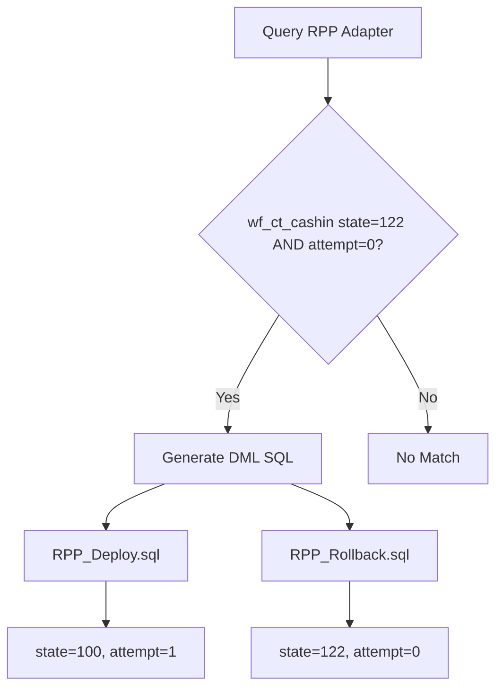

# RPP Cashin Validation Failed Case Implementation Plan

## Overview
Add a new SOP case to handle RPP cashin workflow (`wf_ct_cashin`) stuck at state `stFieldsValidationFailed(122)` with `attempt=0`.

## Scenario Description
When the RPP cashin workflow is in state `stFieldsValidationFailed(122)` with `attempt=0`, generate DML SQL statements to:
- **Deploy**: Reset workflow to state `stTransferPersisted(100)` with `attempt=1` to retry validation
- **Rollback**: Restore workflow to state `stFieldsValidationFailed(122)` with `attempt=0`

## Workflow State Context
From `wf_ct_cashin` workflow state map:
- `100`: `stTransferPersisted` - Initial persisted state
- `122`: `stFieldsValidationFailed` - Field validation failed state

## Implementation Steps

### 1. Add New Case Constant
**File**: [`internal/txn/domain/types.go`](internal/txn/domain/types.go)

Add a new case constant:
```go
CaseRppCashinValidationFailed122_0 Case = "rpp_cashin_validation_failed_122_0"
```

### 2. Add SOP Rule
**File**: [`internal/txn/adapters/sop_rules.go`](internal/txn/adapters/sop_rules.go)

Add a new rule to identify when this case applies:
```go
{
    CaseType:    domain.CaseRppCashinValidationFailed122_0,
    Description: "RPP Cashin Validation Failed at state 122 with attempt 0",
    Country:     "my",
    Conditions: []RuleCondition{
        {
            FieldPath: "RPPAdapter.Workflow.WorkflowID",
            Operator:  "eq",
            Value:     "wf_ct_cashin",
        },
        {
            FieldPath: "RPPAdapter.Workflow.State",
            Operator:  "eq",
            Value:     "122",
        },
        {
            FieldPath: "RPPAdapter.Workflow.Attempt",
            Operator:  "eq",
            Value:     0,
        },
    },
},
```

### 3. Add SQL Template
**File**: [`internal/txn/adapters/sql_templates.go`](internal/txn/adapters/sql_templates.go)

Add a new SQL template function:
```go
domain.CaseRppCashinValidationFailed122_0: func(result domain.TransactionResult) *domain.DMLTicket {
    return &domain.DMLTicket{
        Deploy: []domain.TemplateInfo{
            {
                TargetDB: "RPP",
                SQLTemplate: `-- rpp_cashin_validation_failed_122_0, retry validation
UPDATE workflow_execution
SET state = 100,
    attempt = 1,
    data = JSON_SET(data, '$.State', 100)
WHERE run_id = %s
AND workflow_id = 'wf_ct_cashin'
AND state = 122;`,
                Params: []domain.ParamInfo{
                    {Name: "run_id", Value: getRPPWorkflowRunID(result.RPPAdapter.Workflow), Type: "string"},
                },
            },
        },
        Rollback: []domain.TemplateInfo{
            {
                TargetDB: "RPP",
                SQLTemplate: `-- RPP Rollback: Move cashin workflow back to state 122
UPDATE workflow_execution
SET state = 122,
    attempt = 0,
    data = JSON_SET(data, '$.State', 122)
WHERE run_id = %s
AND workflow_id = 'wf_ct_cashin';`,
                Params: []domain.ParamInfo{
                    {Name: "run_id", Value: getRPPWorkflowRunID(result.RPPAdapter.Workflow), Type: "string"},
                },
            },
        },
        CaseType: domain.CaseRppCashinValidationFailed122_0,
    }
},
```

### 4. Update Case Summary Order
**File**: [`internal/txn/domain/types.go`](internal/txn/domain/types.go)

Add the new case to `GetCaseSummaryOrder()` function:
```go
return []Case{
    // ... existing cases ...
    CaseRppCashinValidationFailed122_0,
}
```

### 5. Add Documentation
**File**: [`docs/sops/MY_DML_SOP.md`](docs/sops/MY_DML_SOP.md)

Add a new case study section:
```markdown
### rpp_cashin_validation_failed_122_0
- **Case**: RPP Cashin workflow stuck at state 122 (stFieldsValidationFailed) with attempt 0
- **Fix**: Reset workflow to state 100 (stTransferPersisted) with attempt 1 to retry validation
- **References**: [Add DML reference if available]
```

## Generated SQL Output

### RPP_Deploy.sql
```sql
-- rpp_cashin_validation_failed_122_0, retry validation
UPDATE workflow_execution
SET state = 100,
    attempt = 1,
    data = JSON_SET(data, '$.State', 100)
WHERE run_id = '6ec50daa4a373a2f9fae4a6aec670679'
AND workflow_id = 'wf_ct_cashin'
AND state = 122;
```

### RPP_Rollback.sql
```sql
-- RPP Rollback: Move cashin workflow back to state 122
UPDATE workflow_execution
SET state = 122,
    attempt = 0,
    data = JSON_SET(data, '$.State', 122)
WHERE run_id = '6ec50daa4a373a2f9fae4a6aec670679'
AND workflow_id = 'wf_ct_cashin';
```

## Flow Diagram



## Notes
- This is a Malaysia-specific case (Country: "my")
- The `getRPPWorkflowRunID()` helper function extracts the run_id from the workflow slice
- SQL includes safety checks (workflow_id and current state in WHERE clause)
- Follows existing patterns from other RPP cases like `CaseRppCashoutReject101_19`
