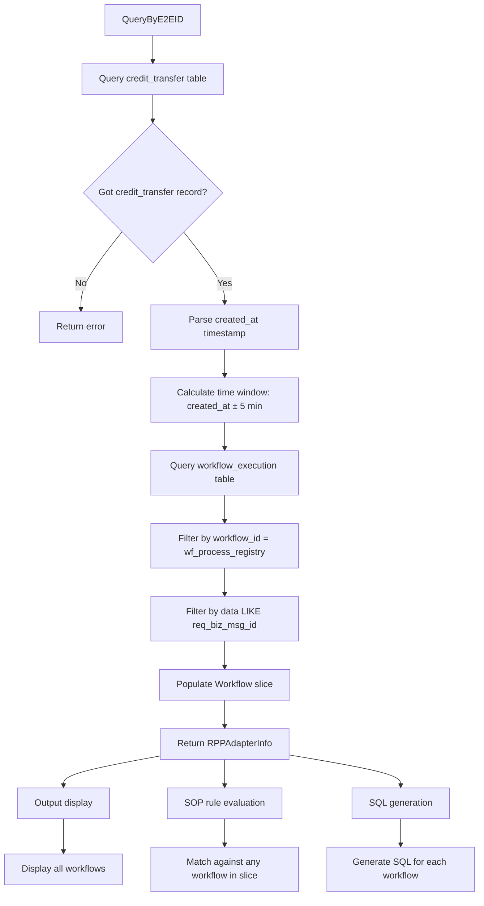

# RPP Adapter Workflow Slice Implementation Plan

## Overview

This plan implements the changes described in [`INSTR.md`](../../INSTR.md) to properly handle multiple workflows for RPP adapter queries. The current code treats `RPPAdapterInfo.Workflow` as a single struct, but it should be a slice of `WorkflowInfo` to support multiple workflow executions.

## Current State Analysis

### Existing Definition (Correct)
```go
// internal/txn/domain/types.go
type RPPAdapterInfo struct {
    ReqBizMsgID string
    PartnerTxID string
    EndToEndID  string
    Status      string
    CreatedAt   string
    Workflow    []WorkflowInfo  // Already defined as slice
    Info        string
}
```

### Problem Areas
The following files treat `Workflow` as a single struct instead of a slice:

1. **`internal/txn/service/adapters/rpp_adapter.go`** - Queries and populates workflow as single struct
2. **`internal/txn/adapters/output.go`** - Displays workflow as single struct
3. **`internal/txn/adapters/sop_evaluator_test.go`** - Tests use single struct
4. **`internal/apps/mybuddy/commands/rpp_resume.go`** - Uses `Workflow.RunID` directly
5. **`internal/txn/adapters/sop_rules.go`** - SOP rules reference `Workflow.State` etc.
6. **`internal/txn/adapters/sql_templates.go`** - SQL templates use `Workflow.RunID`
7. **`internal/txn/adapters/sql_generator.go`** - Generator uses `Workflow.RunID`

## New SQL Query Pattern

According to [`INSTR.md`](../../INSTR.md), workflows should be queried using:

```sql
SELECT * FROM workflow_execution
WHERE created_at >= '2025-12-28T06:30:10.292282Z'  -- created_at - 5 min
  AND created_at <= '2025-12-28T06:38:10.292282Z'  -- created_at + 5 min
  AND workflow_id = 'wf_process_registry'
  AND data LIKE '%20251228GXSPMYKL010ORB22837568%';  -- req_biz_msg_id
```

## Architecture Diagram



## Implementation Steps

### Step 1: Update rpp_adapter.go

**File:** `internal/txn/service/adapters/rpp_adapter.go`

**Changes:**
1. Parse the `created_at` timestamp from credit_transfer record
2. Calculate time window: `created_at - 5 min` and `created_at + 5 min`
3. Query workflow_execution table with new pattern:
   - Filter by `workflow_id = 'wf_process_registry'`
   - Filter by time window
   - Filter by `data LIKE '%req_biz_msg_id%'`
4. Populate `Workflow` as a slice of `WorkflowInfo`
5. Handle case where no workflows are found (empty slice)

**Helper Functions Needed:**
- Time parsing and calculation (parse ISO timestamp, add/subtract 5 minutes)

### Step 2: Update output.go

**File:** `internal/txn/adapters/output.go`

**Changes:**
1. Modify `displayRPPAdapterSection` to iterate over `Workflow` slice
2. Display each workflow with its own header and details
3. Handle empty workflow slice gracefully

### Step 3: Update sop_evaluator.go

**File:** `internal/txn/adapters/sop_evaluator.go`

**Changes:**
1. Modify `getFieldValue` to handle slice fields
2. When field is a slice and condition references a field within slice elements:
   - Return true if ANY element in slice matches the condition
   - For `eq ""` on empty slice: return true
   - For `ne ""` on empty slice: return false
3. Maintain backward compatibility with non-slice fields

**Special Logic for RPPAdapter.Workflow:**
- When evaluating `RPPAdapter.Workflow.State`, check if ANY workflow in the slice matches
- When checking `RPPAdapter.Workflow.WorkflowID`, check if ANY workflow matches
- When checking `RPPAdapter.Workflow.Attempt`, check if ANY workflow matches

### Step 4: Update sop_evaluator_test.go

**File:** `internal/txn/adapters/sop_evaluator_test.go`

**Changes:**
1. Update test cases to use `Workflow []WorkflowInfo` instead of single struct
2. Add tests for:
   - Empty workflow slice
   - Single workflow in slice
   - Multiple workflows in slice
   - Matching condition on any workflow in slice

### Step 5: Update rpp_resume.go

**File:** `internal/apps/mybuddy/commands/rpp_resume.go`

**Changes:**
1. Update `generateRppResumeSQLBatch` to collect run IDs from all workflows in slice
2. Iterate over `result.RPPAdapter.Workflow` slice to get all run IDs
3. Handle case where workflow slice is empty

### Step 6: Update sql_templates.go

**File:** `internal/txn/adapters/sql_templates.go`

**Changes:**
1. For RPP-related cases, handle `Workflow` slice
2. Generate SQL for each workflow in the slice
3. Combine multiple run IDs into a single `IN (...)` clause

### Step 7: Update sql_generator.go

**File:** `internal/txn/adapters/sql_generator.go`

**Changes:**
1. Update `GetRunIDForRPP` to handle workflow slice
2. Return the first workflow's run ID (or all run IDs as slice)
3. Handle empty workflow slice case

### Step 8: Update sop_rules.go

**File:** `internal/txn/adapters/sop_rules.go`

**Changes:**
1. No structural changes needed - SOP rules use field paths like `RPPAdapter.Workflow.State`
2. The updated `sop_evaluator.go` will handle slice evaluation transparently
3. Verify all RPP-related rules still work correctly

### Step 9: Write Unit Tests

**New File:** `internal/txn/service/adapters/rpp_adapter_test.go`

**Test Cases:**
1. Query with valid E2E ID returns workflows
2. Query with invalid E2E ID returns error
3. Query returns multiple workflows within time window
4. Query returns empty workflow slice when no matches found
5. Time window calculation is correct

### Step 10: Verification

**Manual Testing:**
1. Test all RPP-related SOP cases with new slice format
2. Verify output displays multiple workflows correctly
3. Verify SQL generation works with multiple workflows
4. Verify rpp_resume command works with multiple workflows

## Key Design Decisions

### SOP Rule Evaluation with Slices

When evaluating SOP rules against `RPPAdapter.Workflow` (a slice):

**For `eq` operator:**
- If slice is empty and value is `""`: return true (backward compatible)
- If slice is empty and value is not `""`: return false
- If ANY element in slice matches: return true
- Otherwise: return false

**For `ne` operator:**
- If slice is empty and value is `""`: return false
- If slice is empty and value is not `""`: return true
- If ALL elements in slice don't match: return true
- Otherwise: return false

**For `in` operator:**
- Check if ANY element in slice is in the provided list

### SQL Generation with Multiple Workflows

For RPP cases that generate SQL:
- Collect all run IDs from the workflow slice
- Use `IN (...)` clause to include all run IDs
- If slice is empty, skip SQL generation

## Files to Modify

| File | Changes |
|------|---------|
| `internal/txn/service/adapters/rpp_adapter.go` | Query workflows using new pattern, populate slice |
| `internal/txn/adapters/output.go` | Display multiple workflows |
| `internal/txn/adapters/sop_evaluator.go` | Handle slice fields in rule evaluation |
| `internal/txn/adapters/sop_evaluator_test.go` | Update tests for slice format |
| `internal/apps/mybuddy/commands/rpp_resume.go` | Handle workflow slice |
| `internal/txn/adapters/sql_templates.go` | Handle workflow slice for RPP cases |
| `internal/txn/adapters/sql_generator.go` | Handle workflow slice for RPP cases |
| `internal/txn/service/adapters/rpp_adapter_test.go` | New file with unit tests |

## Notes

- The `RPPAdapterInfo.Workflow` field is already correctly defined as `[]WorkflowInfo` in `types.go`
- No changes needed to `types.go`
- Time parsing requires careful handling of ISO 8601 timestamps
- The 5-minute time window should be configurable or well-documented
- All changes should maintain backward compatibility where possible
