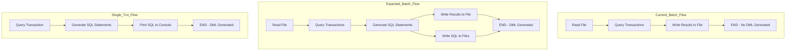

# TS-4558: Batch Processing DML Generation Fix

## Root Cause Analysis

The batch processing workflow in [`internal/apps/common/batch/processor.go`](internal/apps/common/batch/processor.go) identifies SOP cases but does NOT generate corresponding DML scripts.

### Current Behavior

When processing a file with multiple transaction IDs:
1. [`ProcessTransactionFile()`](internal/apps/common/batch/processor.go:15) reads transaction IDs from file
2. Queries each transaction using `clients.TxnSvc.QueryTransactionWithEnv()`
3. Writes results to file using [`WriteBatchResults()`](internal/txn/adapters/output.go:12)
4. **MISSING**: Never calls [`GenerateSQLStatements()`](internal/txn/adapters/sql.go:18) to generate DML
5. **MISSING**: Never calls [`WriteSQLFiles()`](internal/txn/adapters/sql_writer.go:26) to write SQL to files

### Expected Behavior (Single Transaction)

When processing a single transaction:
1. [`processSingleTransaction()`](internal/apps/mybuddy/commands/txn.go:44) queries transaction
2. Calls [`GenerateSQLStatements()`](internal/txn/adapters/sql.go:18) to generate DML
3. Prints SQL to console using [`printSQLToConsole()`](internal/apps/mybuddy/commands/txn.go:80)

### Existing Infrastructure

The [`sql_writer.go`](internal/txn/adapters/sql_writer.go) file already provides:
- [`WriteSQLFiles()`](internal/txn/adapters/sql_writer.go:26) - writes SQL statements to fixed filenames:
  - `PC_Deploy.sql`, `PC_Rollback.sql`
  - `PE_Deploy.sql`, `PE_Rollback.sql`
  - `PPE_Deploy.sql`, `PPE_Rollback.sql`
  - `RPP_Deploy.sql`, `RPP_Rollback.sql`
- [`ClearSQLFiles()`](internal/txn/adapters/sql_writer.go:11) - removes all existing SQL files

### Flow Diagram

## Solution

Modify [`ProcessTransactionFile()`](internal/apps/common/batch/processor.go:15) to:

1. Generate SQL statements after collecting results
2. Write SQL statements to a separate file (e.g., `<input_file>_results_sql.txt`)

### Implementation Steps

1. **Add SQL Generation Call**
   - After collecting results, call `adapters.GenerateSQLStatements(results)`
   - Store the returned `domain.SQLStatements`

2. **Add SQL Output to Files**
   - Call existing `adapters.WriteSQLFiles(statements, basePath)` to write SQL to fixed filenames:
     - `PC_Deploy.sql`, `PC_Rollback.sql`
     - `PE_Deploy.sql`, `PE_Rollback.sql`
     - `PPE_Deploy.sql`, `PPE_Rollback.sql`
     - `RPP_Deploy.sql`, `RPP_Rollback.sql`
   - The function already handles empty arrays (only creates files for databases with SQL)

3. **Update User Feedback**
   - Print message indicating batch processing completed
   - The `WriteSQLFiles()` function already prints which files were created
   - Handle case where no SQL was generated

### Technical Notes

- The transfer table UPDATE uses `UpdatedAt` field (not `CreatedAt`) for the `updated_at` column
- This is already handled correctly in existing `generateTransferUpdateSQL()` function

### Files to Modify

- [`internal/apps/common/batch/processor.go`](internal/apps/common/batch/processor.go) - Add SQL generation and output

## Test Plan

1. Run batch processing with `TS-4558.txt`
2. Verify:
   - `TS-4558.txt_results.txt` contains transaction status (existing behavior)
   - `PE_Deploy.sql` contains DML scripts for identified PE cases
   - Cases like `pe_stuck_at_limit_check_102_4` generate appropriate SQL

CURRENTLY it still does not work

still not working frank.nguyen@DBSG-H4M0DVF2C7 buddy % make deploy && mybuddy txn TS-4558.txt
Building mybuddy with Malaysia environment...
mybuddy built successfully
Building sgbuddy with Singapore environment...
sgbuddy built successfully
Building and deploying binaries...
Building mybuddy with Malaysia environment...
mybuddy built successfully
Building sgbuddy with Singapore environment...
sgbuddy built successfully
Deployed to /Users/frank.nguyen/bin
You can now use 'mybuddy' and 'sgbuddy' commands from anywhere.
[MY] Processing batch file: TS-4558.txt
[MY] Found 4 transaction IDs to process
[MY] Processing 1/4: 253c9e27c69f465bbeed564eb16a4f0e
[MY] Processing 2/4: 8d69bd2672a041c78d2c18784f83d8eb
[MY] Processing 3/4: 198fe80766cb48b4aca3cf8a38f5baa5
[MY] Processing 4/4: 90a8976b531446be8e00d42f02ff2d0d
[MY] 
Writing batch results to: TS-4558.txt_results.txt
[MY] Batch processing completed. Results written to TS-4558.txt_results.txt
frank.nguyen@DBSG-H4M0DVF2C7 buddy % ls *.sql
zsh: no matches found: *.sql
frank.nguyen@DBSG-H4M0DVF2C7 buddy %

I see no sql files are generated
