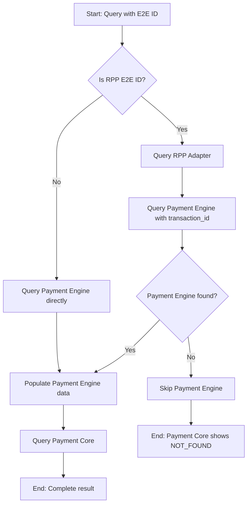

# Payment Engine Population Plan for RPP E2E IDs

## Problem Statement
Currently, when querying RPP E2E IDs, the system shows data from rpp-adapter but payment-core and Classification show NOT_FOUND. This happens because the direct Payment Engine query fails, and the system doesn't attempt an alternative query using the E2E ID as an external_id with a time window.

## Current Flow


## Proposed Flow
```mermaid
flowchart TD
    A[Start: Query with E2E ID] --> B{Is RPP E2E ID?}
    B -->|Yes| C[Query RPP Adapter<br/>(include created_at)]
    B -->|No| D[Query Payment Engine directly]
    C --> E[Query Payment Engine with transaction_id]
    D --> F[Populate Payment Engine data]
    E --> G{Payment Engine found?}
    G -->|Yes| F
    G -->|No| H[Query Payment Engine with<br/>external_id + time window]
    H --> I{Payment Engine found?}
    I -->|Yes| F
    I -->|No| J[Payment Engine shows NOT_FOUND]
    F --> K[Query Payment Core]
    J --> L[End: Payment Core shows NOT_FOUND]
    K --> M[End: Complete result]
```

## Implementation Steps

### 1. Modify RPPAdapter.QueryByE2EID
- Add `created_at` to the SELECT query for credit_transfer table
- Populate the `CreatedAt` field in RPPAdapterInfo

### 2. Add QueryTransferByExternalID method to PaymentEngineAdapter
- Create a new method that accepts external_id and created_at timestamp
- Implement time window logic (±30 minutes from created_at)
- Query the transfer table with these parameters

### 3. Update TransactionQueryService
- When direct Payment Engine query fails for RPP E2E IDs
- Use the new QueryTransferByExternalID method with EndToEndID and CreatedAt from RPP adapter
- Continue with normal flow if Payment Engine data is found

### 4. Testing
- Verify with the provided E2E IDs that payment-engine data is now populated
- Ensure payment-core data is also populated when payment-engine data is available

## SQL Queries

### RPP Adapter Query (Updated)
```sql
SELECT req_biz_msg_id, partner_tx_id, partner_tx_sts AS status, created_at 
FROM credit_transfer 
WHERE end_to_end_id = '[E2E_ID]'
```

### Payment Engine Query (New)
```sql
SELECT transaction_id, status, reference_id, created_at, updated_at, 
       type, txn_subtype, txn_domain, external_id 
FROM transfer 
WHERE external_id='[E2E_ID]'
AND created_at >= '[created_at - 30 minutes]'
AND created_at <= '[created_at + 30 minutes]'
```

## Benefits
1. Complete transaction data for RPP E2E IDs
2. Better visibility into payment flow
3. More accurate classification of transactions
4. Improved debugging capabilities


// RPPAdapterInfo contains RPP adapter related information
type RPPAdapterInfo struct {
	ReqBizMsgID string // RPP request business message ID
	PartnerTxID string // RPP partner transaction ID
	EndToEndID  string // = payment-engine.transfers.external_id
	Status      string // RPP status
	CreatedAt   string // created_at timestamp
	Workflow    WorkflowInfo
	Info        string // optional extra context (e.g. status reason description)
}

add created_at to the query to fill RPPAdapterInfo

then use EndToEndID, CreatedAt to query payment-engine 

SELECT * FROM transfer where external_id='20251211MBBEMYKL070ORB42241026'
and created_at >= '2025-12-11T05:15:52.416045Z' -- created_at - 30min
and created_at <= '2025-12-11T06:15:52.416045Z' -- created_at + 30min