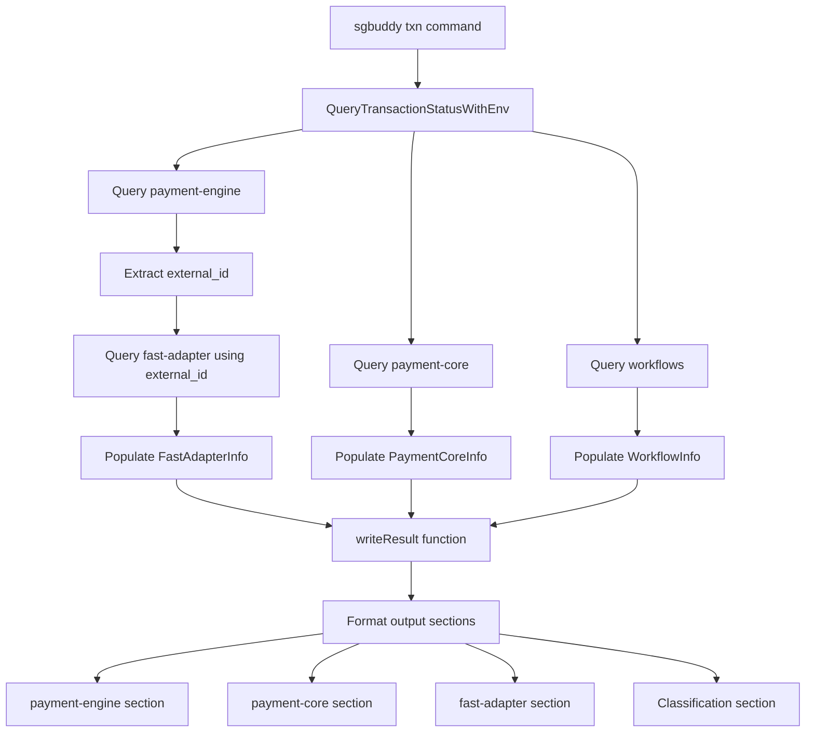

# SGBuddy Output Format Enhancement Plan

## Overview
This plan outlines the changes needed to implement the new output format for the `sgbuddy txn` command to match the requested format.

## Current vs. Target Format

### Current Format
The current implementation shows:
- Basic transaction information
- Payment-engine status and workflow
- Payment-core internal/external transactions
- RPP adapter information (for Malaysia)
- Classification section

### Target Format
The new format requires:
- Enhanced payment-engine section with type/subtype/domain
- Specific workflow format with state and attempt
- Payment-core with NOT_FOUND handling
- Fast Adapter section (Singapore only)
- Classification with "no_case_matched"

## Implementation Architecture



## Detailed Changes

### 1. Data Structure Updates

#### FastAdapterInfo Enhancement
```go
type FastAdapterInfo struct {
    InstructionID     string // instruction_id or external_id
    Type             string // cashin, cashout, etc.
    Status           string // StErraneous, etc.
    StatusCode       int    // Numeric status code
    CancelReasonCode string // cancel_reason_code
    RejectReasonCode string // reject_reason_code
}
```

### 2. Query Logic Updates

#### Fast Adapter Query
- Use external_id from payment-engine transfers table
- Query instruction table in fast-adapter database
- Extract status, type, and reason codes

#### Payment-Core NOT_FOUND Handling
- Check if internal/external transactions exist
- Display "NOT_FOUND" when no transactions are found

### 3. Output Formatting Updates

#### Payment-Engine Section
```
[payment-engine]
type: {transfers.type}
subtype: {transfers.txn_subtype}
domain: {transfers.txn_domain}
status: {transfers.status}
created_at: {transfers.created_at}
{workflow_execution.workflow_id}: state=stTransferProcessing(220) attempt=0 run_id=d800f759-d271-4db9-8b9e-f567323b0bb9
```

#### Payment-Core Section
```
[payment-core]
internal_transaction: {tx_type} {tx_status} | {tx_type} {tx_status}
external_transaction: {tx_type} {tx_status} | {tx_type} {tx_status}
internal_payment_flow: state=stSuccess(900) attempt=0 run_id=04b54792c3f843418fe9ab9a31803b59
external_payment_flow: state=stSubmitted(200) attempt=11 run_id=717101d108744edcb6d117fcb6bd2c4c
```

#### Fast-Adapter Section
```
[fast-adapter]
FAST ID: 123 (instruction_id or external_id from above)
type: cashin
transactions.status: StErraneous (4)
cancel_reason_code: 123
reject_reason_code: 123
```

## Implementation Steps

1. **Update FastAdapterInfo struct** in `types.go`
2. **Add Fast Adapter query logic** in `query.go`
3. **Enhance QueryTransactionStatusWithEnv** to fetch Fast Adapter data
4. **Update writeResult function** in `output.go` for new format
5. **Modify payment-engine section** to include type/subtype/domain
6. **Update payment-core section** with NOT_FOUND handling
7. **Add specific workflow formatting** for payment-core
8. **Implement fast-adapter section** formatting
9. **Ensure classification section** displays correctly
10. **Test with example transaction**

## Key Considerations

- Fast Adapter is only available in Singapore environment
- Need to handle cases where Fast Adapter data is not found
- Maintain backward compatibility with existing functionality
- Ensure proper error handling for database queries
- Format status codes with numeric values in parentheses

## Testing Strategy

1. Test with transaction ID that has Fast Adapter data
2. Test with transaction ID that has no Fast Adapter data
3. Verify payment-core NOT_FOUND handling
4. Check workflow formatting is correct
5. Validate classification section displays correctly


Based on the current task to implement the new output format for sgbuddy txn command, here are the TODOs that need to be completed:

Update FastAdapterInfo struct in types.go - Add StatusCode, CancelReasonCode, and RejectReasonCode fields to support the new fast-adapter output format

Modify query.go to add Fast Adapter database query functionality - Implement function to query fast-adapter database using external_id from payment-engine

Enhance QueryTransactionStatusWithEnv to fetch Fast Adapter data - Integrate fast-adapter query into the main transaction query flow

Update writeResult function in output.go to format new output structure - Modify the output formatting to match the requested format

Modify payment-engine section to include type, subtype, and domain fields - Add these fields to the payment-engine output section

Update payment-core section to show "NOT_FOUND" when no transactions exist - Handle cases where internal/external transactions are missing

Add workflow_internal_payment_flow and workflow_external_payment_flow to payment-core section - Format specific workflow types with state and attempt information

Implement fast-adapter section with proper formatting - Add the new fast-adapter section showing FAST ID, type, status, and reason codes

Ensure classification section displays "no_case_matched" when appropriate - Verify classification output shows correct text when no case matches

Test implementation with example transaction ID - Verify the complete output format works correctly with a real transaction

These tasks need to be completed in order to transform the current output format to match the requested format with all the additional fields and sections.
