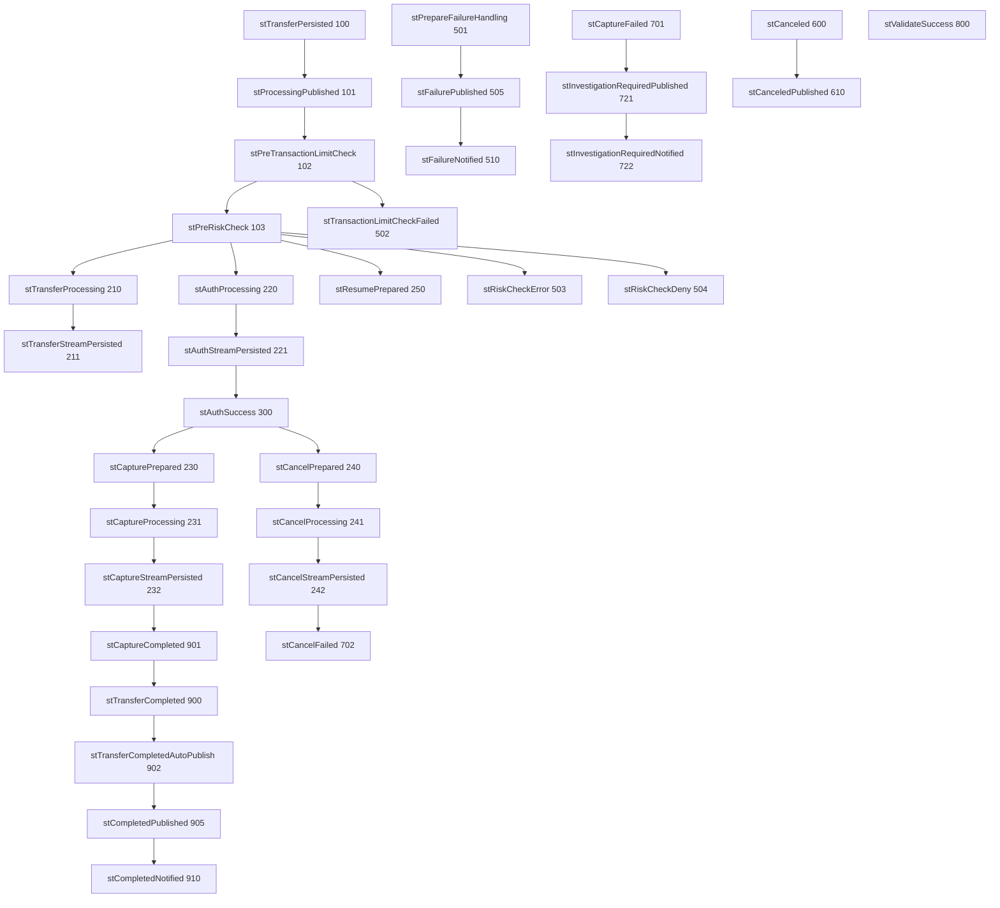

# Workflow Transfer Collection State Flow

## State Flow Diagram

## State Categories

### Initial States (100-103)
- `stTransferPersisted` (100) - Transfer has been persisted
- `stProcessingPublished` (101) - Processing event has been published
- `stPreTransactionLimitCheck` (102) - Pre-transaction limit check in progress
- `stPreRiskCheck` (103) - Pre-risk assessment in progress

### Processing States (210-250)
- `stTransferProcessing` (210) - Transfer is being processed
- `stTransferStreamPersisted` (211) - Transfer stream has been persisted
- `stAuthProcessing` (220) - Authentication in progress
- `stAuthStreamPersisted` (221) - Authentication stream has been persisted
- `stAuthSuccess` (300) - Authentication successful
- `stCapturePrepared` (230) - Capture has been prepared
- `stCaptureProcessing` (231) - Capture is being processed
- `stCaptureStreamPersisted` (232) - Capture stream has been persisted
- `stCancelPrepared` (240) - Cancellation has been prepared
- `stCancelProcessing` (241) - Cancellation is being processed
- `stCancelStreamPersisted` (242) - Cancellation stream has been persisted
- `stResumePrepared` (250) - Resume has been prepared
- `stValidateSuccess` (800) - Validation successful

### Failure Handling States (501-510)
- `stPrepareFailureHandling` (501) - Asynchronous flow failure handling
- `stTransactionLimitCheckFailed` (502) - Transaction limit check failed
- `stRiskCheckError` (503) - Risk check service internal error
- `stRiskCheckDeny` (504) - Risk check returned Deny response
- `stFailurePublished` (505) - Failure has been published
- `stFailureNotified` (510) - Failure has been notified

### Cancellation States (600-610)
- `stCanceled` (600) - Transfer has been canceled
- `stCanceledPublished` (610) - Cancellation has been published

### Investigation Required States (701-722)
- `stCaptureFailed` (701) - Capture failed (investigation required)
- `stCancelFailed` (702) - Cancel failed (investigation required)
- `stInvestigationRequiredPublished` (721) - Investigation required has been published
- `stInvestigationRequiredNotified` (722) - Investigation required has been notified

### Completion States (900-910)
- `stTransferCompleted` (900) - Transfer has been completed
- `stCaptureCompleted` (901) - Capture has been completed
- `stTransferCompletedAutoPublish` (902) - Transfer completion auto-published
- `stCompletedPublished` (905) - Completion has been published
- `stCompletedNotified` (910) - Completion has been notified